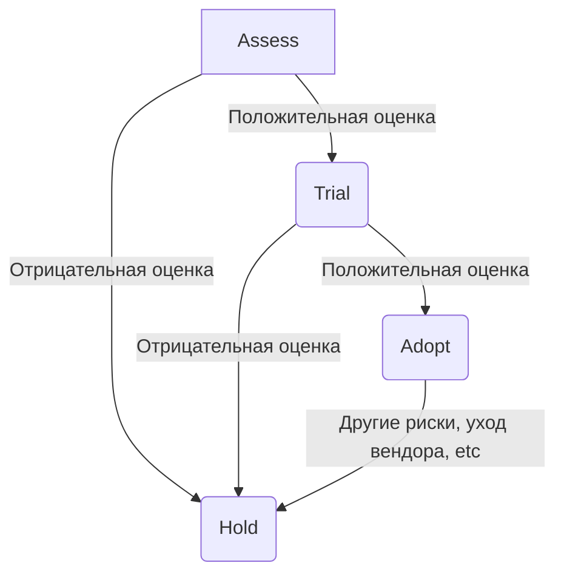

# DevOps техрадар Byndyusoft

Ссылка на радар: https://radar.thoughtworks.com/?documentId=https%3A%2F%2Fraw.githubusercontent.com%2FByndyusoft%2Fdevops-techradar%2Fmaster%2Fradar.csv

Интерпритация колец:
1. Adopt - рекомендованно
2. Trial - обкатка
3. Assess - оценка
4. Hold - нежелательно

Преимущество отдаётся opensource приложениям со свободной лицензией.

Все изменения в техрадаре должны проходить через PR и обсуждение в стриме.